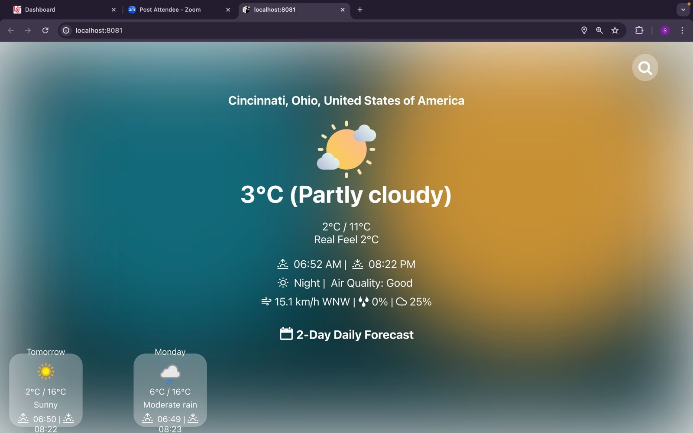
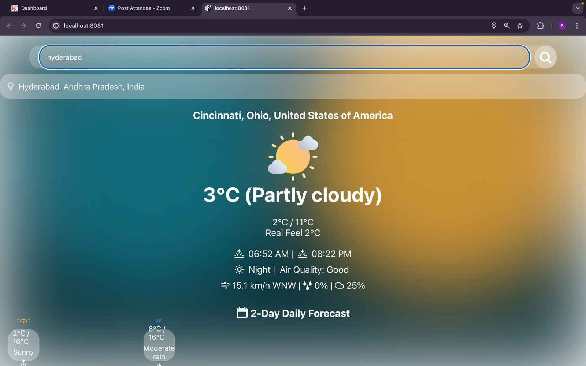
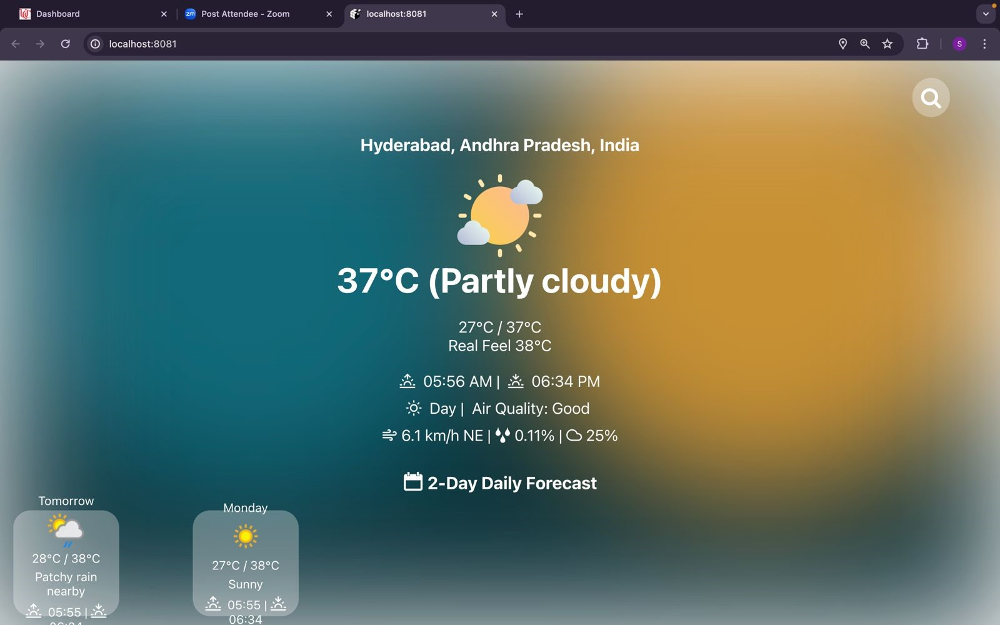
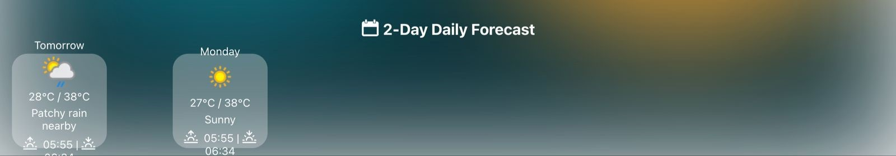

# Weather App

This is a weather application built with Expo 49 on React Native.

## Features

- Get current weather information based on user's location
- Search for weather information of any location
- Display detailed weather information including temperature, humidity, wind speed, etc.
- Show weather forecast for the next 5 days

## Installation

Write in the terminal:

```bash
npm install
npm start
```

- To start the application on the Expo Go app, follow these steps:
  - Install the Expo Go app on your mobile device from the App Store or Google Play Store.
  - Make sure your mobile device and development machine are connected to the same Wi-Fi network.
  - Open the terminal or command prompt and navigate to the project directory.
  - Run the command npm start to start the Expo development server.
  - Wait for the development server to start and display a QR code in the terminal or command prompt.
  - Open the Expo Go app on your mobile device.
  - Tap on the "Scan QR Code" option within the Expo Go app.
  - Use your device's camera to scan the QR code displayed in the terminal or command prompt.
  - Once scanned, the Expo Go app will load and run your application.
 





